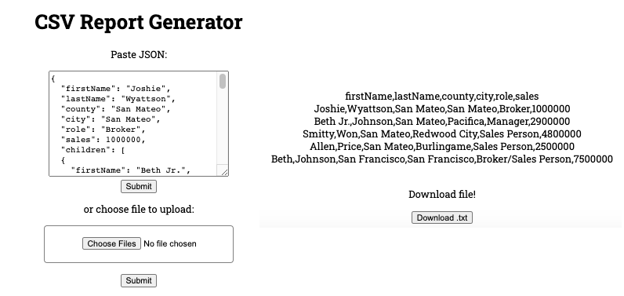

# CSV Generator

Simple jQuery app that converts JSON data to CSV formatted text. The user can input data via a form or upload, preview the result, and download the converted text as a .txt file afterwards.

## Setup:

1. `git clone`
1. install dependencies with `npm install`
1. start server with `npm run start`
1. verify app up and running at `localhost:3000`
